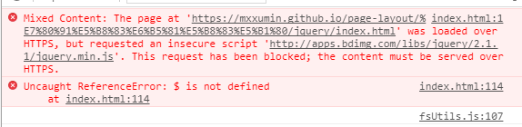

# jquery库 :bank::bank::bank:

**github中展示的一些demo有时需要使用jquery。如果每个demo都下载并上传jquery文件是一件很麻烦又浪费空间的事，所以使用jquery在线地址是个很棒的主意，但是在使用一些常见网站的jquery在线地址时，会出现访问跨域问题，如下图所示：**
***

***
**为了解决这种问题，决定在github中创建一个jquery库，方便以后使用。**

>在html文件中加入下面一行代码，github中需要使用jquery的demo就会顺利的运行起来 :smile::smile::smile:

```
<script src="https://mxxumin.github.io/page-layout/jquerylib/jquery/jquery-3.2.1.min.js"></script>
```
