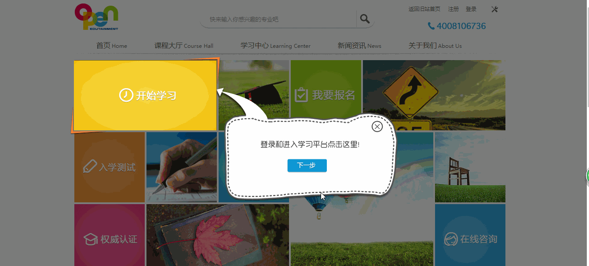

# 新手导航效果 :art::art::art:

效果图如下：
***

***

`Demo-javascript代码实现`:point_right:[演示地址](https://xm2by.github.io/page-layout/%E7%80%91%E5%B8%83%E6%B5%81%E5%B8%83%E5%B1%80/javascript/index.html):point_left:

`Demo-jquery代码实现`:point_right:[演示地址](https://xm2by.github.io/page-layout/%E7%80%91%E5%B8%83%E6%B5%81%E5%B8%83%E5%B1%80/jquery/index.html):point_left:

> `“新手导航效果”`是引导用户一步步熟悉使用网站的一种效果，可以让用户更方便地了解网站。

### 新手导航效果特点：

**1、通过cookie判断用户是否已经访问过，如果是初次访问则显示导航；**

**2、用户可以按照引导一步步了解网站特点，也可以随时关闭导航；**

***

* 利用原生js实现的代码见`javascript`文件
* 利用jquery实现的代码见`jquery`文件
* 图片素材见`img`文件

> `Notice`：`Demo`中的图片素材源自网络！！！